# 学习目标

1、能够复述订单的操作流程【总述、添加菜品、移除菜品】

2、理解订单及菜品加联锁的意义

3、掌握转台的前提条件并且完成转台功能开发

4、了解餐掌柜中订单转台的转换

5、掌握为什么要根据订单生成交易单

6、掌握退款的前提条件并且完成退款功能开发

# 第一章 商家平台-订单操作

## 1、功能区拆解

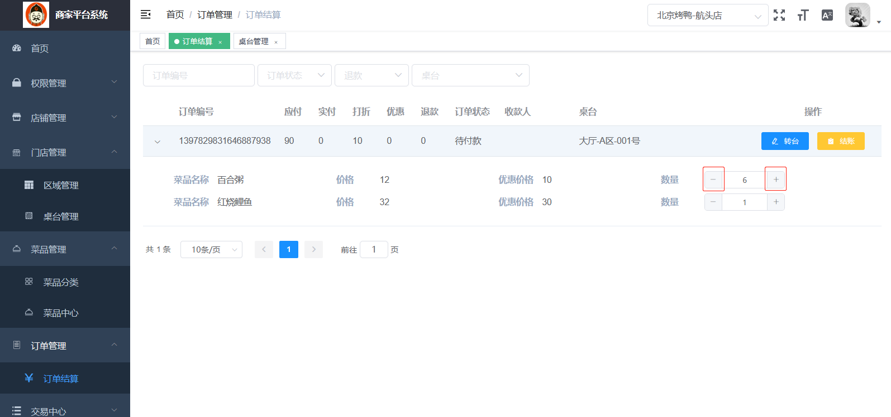

用户在下单后，对菜品数量进行调整，可告知服务员，服务员可以再后台进行订单操作，做订单操作需要满足下列条件

> 1、当前桌台的订单状态：待付款【DFK】
>
> 2、追加菜品，菜品库存足够
>
> 3、退菜时，当菜品数量变0，但不会删除订单项，且退菜不可以把库存退成负数

下图为整个订单项操作的流程图，我们首先进行下流程分析：

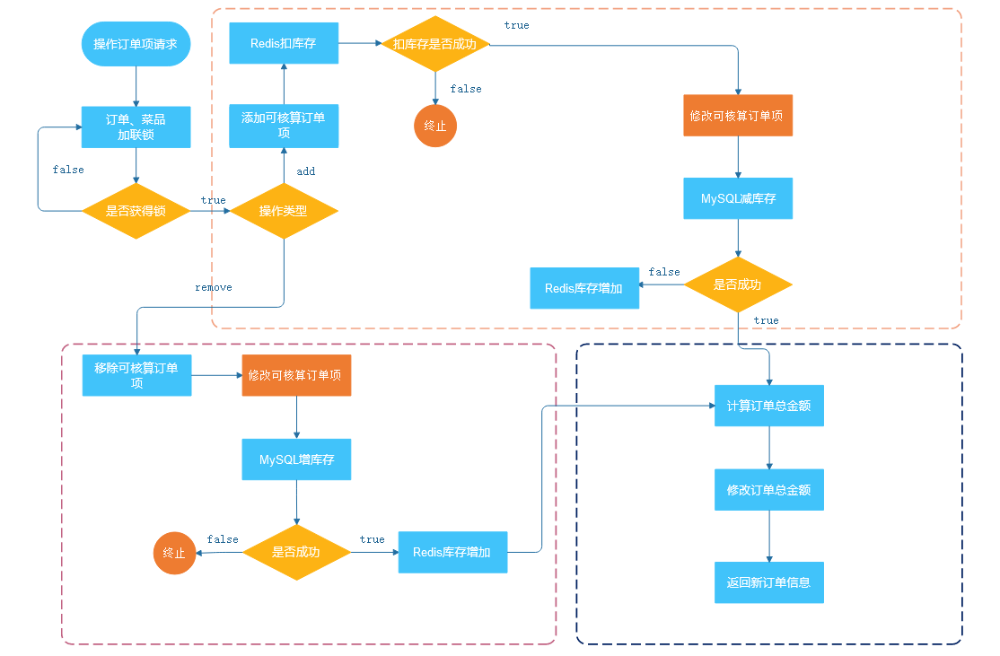

## 2、功能开发

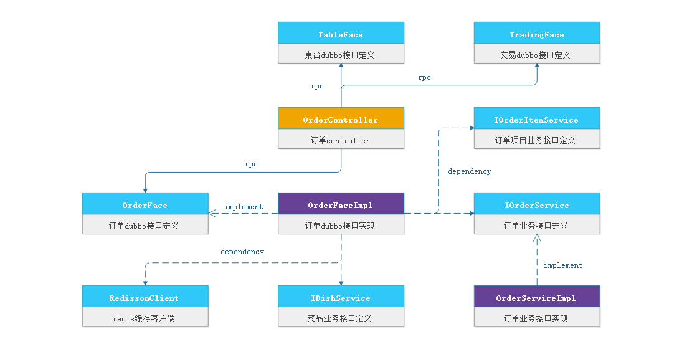

- **OrderController**

传入菜品、订单号、操作类型

```java
@PostMapping("opertion-to-orderItem/{dishId}/{orderNo}/{opertionType}")
    @ApiOperation(value = "操作订单菜品数量",notes = "操作订单菜品数量")
    @ApiImplicitParams({
        @ApiImplicitParam(paramType = "path",name = "dishId",value = "菜品ID",dataType = "Long"),
        @ApiImplicitParam(paramType = "path",name = "orderNo",value = "订单编号",dataType = "Long"),
        @ApiImplicitParam(paramType = "path",name = "opertionType",value = "操作动作"dataType = "String")
    })
    public ResponseWrap<OrderVo> opertionToOrderItem(
            @PathVariable("dishId") Long dishId,
            @PathVariable("orderNo") Long orderNo,
            @PathVariable("opertionType") String opertionType) throws ProjectException {
        //调用远程接口
        OrderVo orderVo = orderFace.opertionToOrderItem(dishId,orderNo,opertionType);
        //返回结果
        return ResponseWrapBuild.build(BrandEnum.SUCCEED,orderVo);
    }
```

- **OrderFace**

```JAVA
/***
 * @description 调整订单项菜品数量
 * @param dishId 菜品ID
 * @param orderNo 订单
 * @param opertionType 操作类型
 * @return
 */
OrderVo opertionToOrderItem(Long dishId, Long orderNo, String opertionType) throws ProjectException;
```

- **OrderFaceImpl**

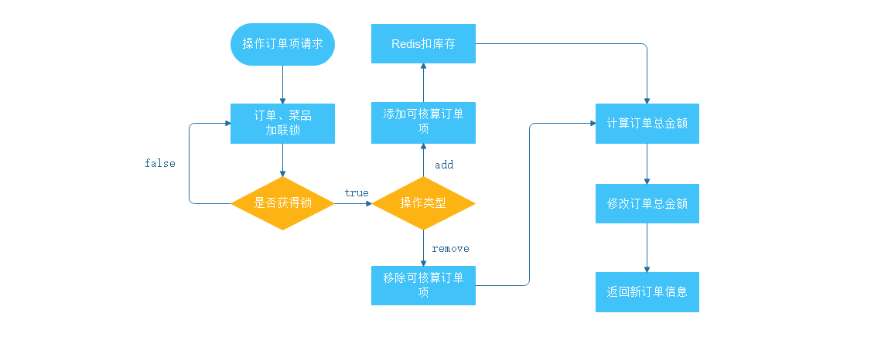

> 1、判定订单待支付状态才可操作
>
> 2、判定菜品处于起售状态才可操作
>
> 3、锁定订单
>
> 4、锁定菜品
>
> ​		4.1、桌台空闲
>
> ​		4.2、桌台非空闲
>
> 5、添加联锁，保证订单和库存都被锁定
>
> 6、操作订单项
>
> ​		6.1添加可核算订单项
>
> ​		6.2、移除可核算订单项
>
> 7、计算订单总金额
>
> 8、修改订单总金额
>
> 9、返回新订单信息

```java
@Override
@GlobalTransactional
public OrderVo opertionToOrderItem(Long dishId, Long orderNo, String opertionType) 
    throws ProjectException {
    //1、判定订单待支付状态才可操作
    OrderVo orderVoResult = orderService.findOrderByOrderNo(orderNo);
    if (!SuperConstant.DFK.equals(orderVoResult.getOrderState())){
        throw new ProjectException(OrderEnum.STATUS_FAIL);
    }
    //2、判定菜品处于起售状态才可操作
    Dish dish = dishService.getById(dishId);
    if (!SuperConstant.YES.equals(dish.getEnableFlag())||
        !SuperConstant.YES.equals(dish.getDishStatus())){
        throw new ProjectException(OrderEnum.DISH_STATUS_FAIL);
    }
    //3、锁定订单
    String keyOrderItem = AppletCacheConstant.ADD_TO_ORDERITEM_LOCK+orderNo;
    RLock lockOrderItem = redissonClient.getLock(keyOrderItem);
    //4、锁定菜品
    String keyDish = AppletCacheConstant.REPERTORY_DISH_LOCK + dishId;
    RLock lockDish = redissonClient.getLock(keyDish);
    //5、添加联锁，保证订单和库存都被锁定
    RedissonMultiLock lock = new RedissonMultiLock(lockOrderItem, lockDish);
    ProjectException projectException = null;
    try {
        if (lock.tryLock(
            AppletCacheConstant.REDIS_WAIT_TIME,
            AppletCacheConstant.REDIS_LEASETIME,
            TimeUnit.SECONDS)){
            String key = AppletCacheConstant.REPERTORY_DISH+dishId;
            RAtomicLong atomicLong = redissonClient.getAtomicLong(key);
            //6.1添加可核算订单项
            if (opertionType.equals(SuperConstant.OPERTION_TYPE_ADD)){
                this.addToOrderItem(dishId,orderNo,atomicLong);
            }
            //6.2、移除可核算订单项
            if (opertionType.equals(SuperConstant.OPERTION_TYPE_REMOVE)){
                this.removeToOrderItem(dishId,orderNo,atomicLong);
            }
            //7、计算订单总金额
            List<OrderItem> orderItemListResult = orderItemService.findOrderItemByOrderNo(orderNo);
            BigDecimal sumPrice = orderItemListResult.stream()
                .map(n->{
                    BigDecimal price = n.getPrice();
                    BigDecimal reducePrice = n.getReducePrice();
                    Long dishNum = n.getDishNum();
                    //如果有优惠价格以优惠价格计算
                    if (EmptyUtil.isNullOrEmpty(reducePrice)){
                        return price.multiply(new BigDecimal(dishNum));
                    }else {
                        return reducePrice.multiply(new BigDecimal(dishNum));
                    }
                }
                    ).reduce(BigDecimal.ZERO, BigDecimal::add);
            orderVoResult.setPayableAmountSum(sumPrice);
             //8、修改订单总金额
            OrderVo orderVoHandler = OrderVo.builder()
                .id(orderVoResult.getId())
                .payableAmountSum(sumPrice)
                .build();
            boolean flag = orderService.updateById(BeanConv.toBean(orderVoHandler, Order.class));
            if (!flag){
                projectException = new ProjectException(OrderItemEnum.SAVE_ORDER_FAIL);
            }
            //9、返回新订单信息
            if (!EmptyUtil.isNullOrEmpty(orderVoResult)){
                List<OrderItemVo> orderItemVoStatisticsList = BeanConv
                    .toBeanList(orderItemListResult, OrderItemVo.class);
                orderVoResult.setOrderItemVoStatisticsList(orderItemVoStatisticsList);
                return orderVoResult;
            }
        }
    } catch (InterruptedException e) {
        log.error("==编辑dishId：{}，orderNo：{}数量加锁失败：{}"
                  ,dishId,orderNo, ExceptionsUtil.getStackTraceAsString(e));
        projectException = new ProjectException(OpenTableEnum.TRY_LOCK_FAIL);
    }finally {
        lock.unlock();
    }
    if (!EmptyUtil.isNullOrEmpty(projectException)){
        throw  projectException;
    }
    return orderVoResult;
}

```

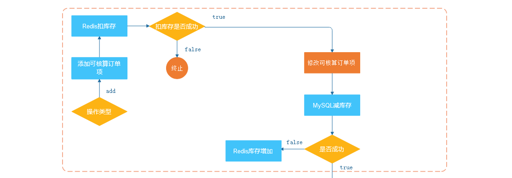

**可核算订单项-添加**

> 1、如果库存够，redis减库存
>
> 2、修改可核算订单项
>
> 3、减菜品库存
>
> 4、减菜品库存失败，归还redis菜品库存
>
> 5、redis库存不足，虽然可以不处理，但建议还是做归还库存

```java
/**
 * @description 添加可核算订单项
 * @param dishId 菜品ID
 * @param orderNo 订单编号
 * @param atomicLong 原子计数器
 * @return
 */
private void addToOrderItem(Long dishId, Long orderNo, RAtomicLong atomicLong) throws ProjectException {
    //1、如果库存够，redis减库存
    if (atomicLong.decrementAndGet()>=0){
        //2、修改可核算订单项
        Boolean flagOrderItem  = orderItemService.updateDishNum(1L, dishId,orderNo);
        //3、减菜品库存
        Boolean flagDish = dishService.updateDishNumber(-1L,dishId);
        if (!flagOrderItem||!flagDish){
            //4、减菜品库存失败，归还redis菜品库存
            atomicLong.incrementAndGet();
            throw new ProjectException(ShoppingCartEnum.UPDATE_DISHNUMBER_FAIL);
        }
    }else {
        //5、redis库存不足，虽然可以不处理，但建议还是做归还库存
        atomicLong.incrementAndGet();
        throw new ProjectException(ShoppingCartEnum.UNDERSTOCK);
    }
}
```

**可核算订单项-移除**

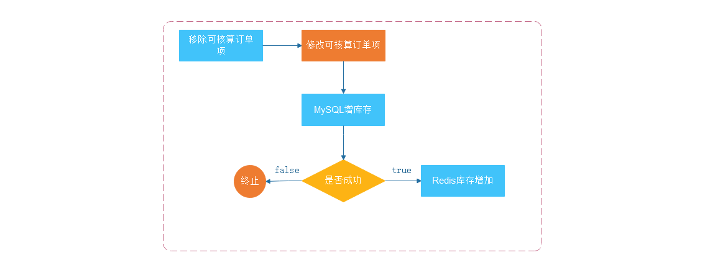

> 1、修改订单项
>
> 2、菜品库存
>
> 3、添加缓存中的库存数量

```java
/**
 * @description 移除订单项
 * @param dishId 菜品ID
 * @param orderNo 订单编号
 * @param atomicLong 原子计数器
 * @return
 */
private void removeToOrderItem(Long dishId, Long orderNo, RAtomicLong atomicLong) throws ProjectException {
    //1、修改订单项
    Boolean flagOrderItem  = orderItemService.updateDishNum(-1L, dishId,orderNo);
    //2、菜品库存
    Boolean flagDish = dishService.updateDishNumber(1L,dishId);
    if (!flagOrderItem||!flagDish){
        throw new ProjectException(ShoppingCartEnum.UPDATE_DISHNUMBER_FAIL);
    }
    //3、添加缓存中的库存数量
    atomicLong.incrementAndGet();
}
```

# 第二章 商家平台-转台

## 1、功能区拆解

转台功能：用户在就餐过程中，因当前桌台不符合其要求，则可寻求服务人员帮其进行换台，需要满足下列条件

> 1、桌台状态：当前桌台【使用中】、目标桌台【空闲中】
>
> 2、目标桌台，不能是当前桌台
>
> 3、当前桌台的账单状态：待付款【DFK】

点击【转台】：

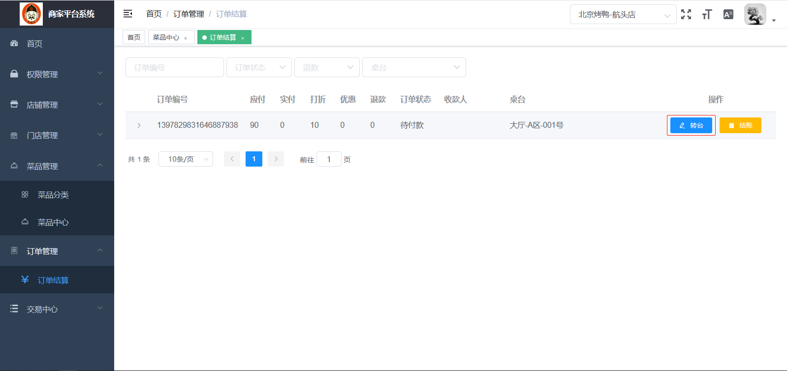

选择【桌台】

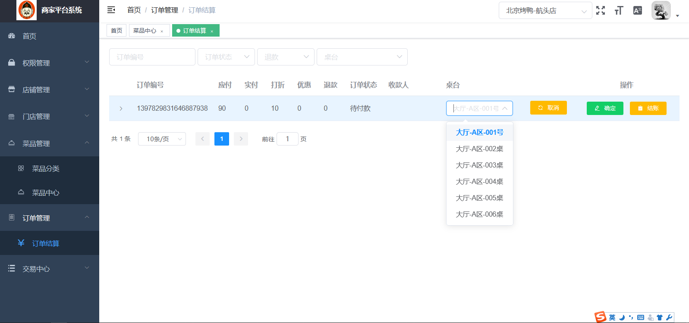

点击【确定】

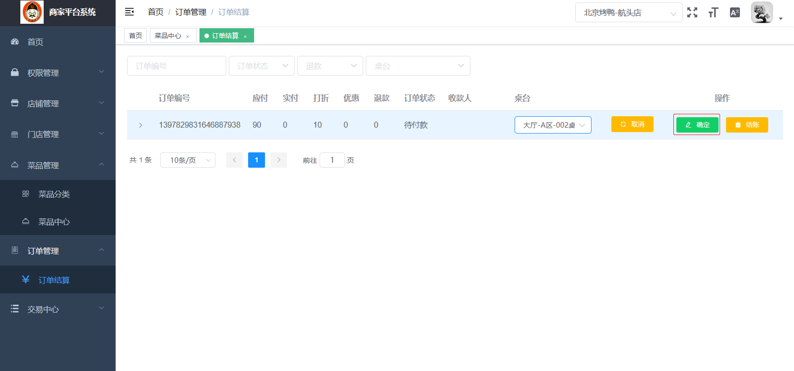

## 2、功能开发

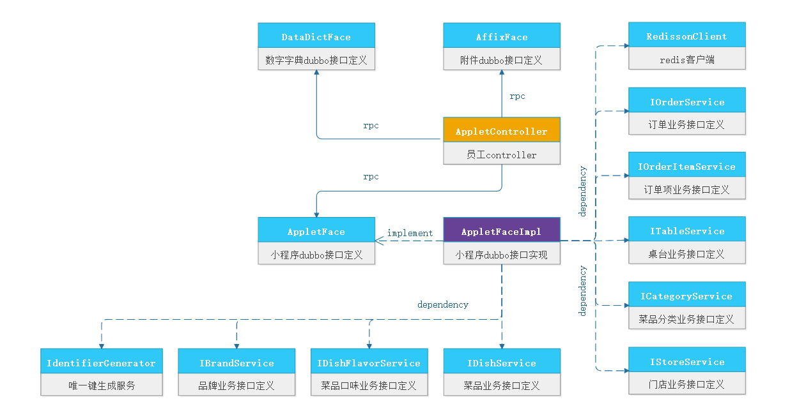

- **AppletController**：

```java
@PostMapping("rotary-table/{sourceTableId}/{targetTableId}/{orderNo}")
@ApiOperation(value = "转台",notes = "转台")
@ApiImplicitParams({
    @ApiImplicitParam(paramType = "path",name = "sourceTableId",value = "源桌台",dataType = "Long"),
    @ApiImplicitParam(paramType = "path",name = "targetTableId",value = "目标桌台",dataType = "Long"),
    @ApiImplicitParam(paramType = "path",name = "orderNo",value = "订单编号",dataType = "Long")
})
public ResponseWrap<Boolean> rotaryTable(
    @PathVariable("sourceTableId") Long sourceTableId,
    @PathVariable("targetTableId") Long targetTableId,
    @PathVariable("orderNo") Long orderNo) throws ProjectException {
    try {
        //转台操作
        Boolean flag = appletFace.rotaryTable(sourceTableId,targetTableId,orderNo);
        //返回结果
        return ResponseWrapBuild.build(BrandEnum.SUCCEED,flag);
    }catch (Exception e){
        log.error("操作购物车详情异常：{}", ExceptionsUtil.getStackTraceAsString(e));
        throw new ProjectException(TableEnum.ROTARY_TABLE_FAIL);
    }
}
```

- **AppletFace**

```java
/***
 * @description 转台业务，满足下列条件才可以转台：
 *  1、oldTableId处于USE状态
 *  2、newTableId处于FREE状态
 *  3、orderNo处于未付款，支付中状态
 * @param sourceTableId 源桌台
 * @param targetTableId 目标桌台
 * @param orderNo 订单号
 * @return
 */
Boolean rotaryTable(Long sourceTableId,Long targetTableId,Long orderNo) throws ProjectException;
```

- **AppletFaceImpl**

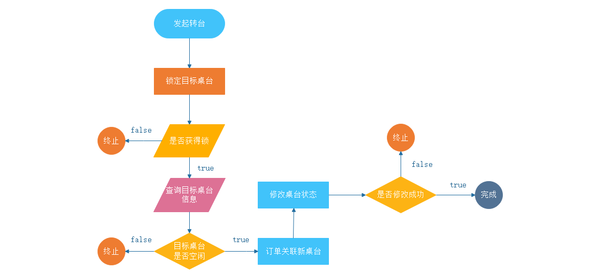

> 1、锁定目标桌台
>
> 2、查询目标桌台
>
> ​		2.1、桌台空闲
>
> ​		2.2、桌台非空闲
>
> 3、订单关联新桌台
>
> 4、修改桌台状态

```java
@Override
@Transactional
public Boolean rotaryTable(Long sourceTableId, Long targetTableId, Long orderNo) 
    throws ProjectException {
    Boolean flag = true;
    //1、锁定目标桌台
    String keyTargetTableId = AppletCacheConstant.OPEN_TABLE_LOCK + targetTableId;
    RLock lock = redissonClient.getLock(keyTargetTableId);
    ProjectException projectException = null;
    try {
        if (lock.tryLock(
            AppletCacheConstant.REDIS_LEASETIME,
            AppletCacheConstant.REDIS_WAIT_TIME,
            TimeUnit.SECONDS)) {
            //2、查询目标桌台
            Table targetTable = tableService.getById(targetTableId);
            //2.1、桌台空闲
            if (SuperConstant.FREE.equals(targetTable.getTableStatus())) {
                //3、订单关联新桌台
                flag = orderService.rotaryTable(sourceTableId, targetTableId, orderNo);
                if (flag) {
                    //4、修改桌台状态
                    tableService.updateTable(TableVo.builder()
                                             .id(targetTableId)
                                             .tableStatus(SuperConstant.USE)
                                             .build());
                    tableService.updateTable(TableVo.builder()
                                             .id(sourceTableId)
                                             .tableStatus(SuperConstant.FREE)
                                             .build());
                } else {
                    projectException = new ProjectException(RotaryTableEnum.ROTARY_TABLE_FAIL);
                }
            } else {
                //2.2桌台非空闲
                projectException = new ProjectException(RotaryTableEnum.ROTARY_TABLE_FAIL);
            }
        }
    } catch (InterruptedException e) {
        log.error("===转台加锁{}失败：{}", sourceTableId, ExceptionsUtil.getStackTraceAsString(e));
        projectException = new ProjectException(OpenTableEnum.TRY_LOCK_FAIL);
    } finally {
        lock.unlock();
    }
    if (!EmptyUtil.isNullOrEmpty(projectException)) {
        throw projectException;
    }
    return flag;
}
```

- **IOrderService**

```java
/***
 * @description 转台操作
 * @param sourceTableId 源桌台
 * @param targetTableId 目标桌台
 * @param orderNo
 * @return
 */
Boolean rotaryTable(Long sourceTableId, Long targetTableId, Long orderNo);
```

- **IOrderServiceImpl**

```java
@Override
public Boolean rotaryTable(Long sourceTableId, Long targetTableId, Long orderNo) {
    //查询目标桌台
    Table table = tableService.getById(targetTableId);
    //订单修改
    Order order = Order.builder()
        .tableId(table.getId())
        .tableName(table.getTableName())
        .areaId(table.getAreaId()).build();
    LambdaQueryWrapper<Order> lambdaQueryWrapper = new LambdaQueryWrapper<>();
    lambdaQueryWrapper.eq(Order::getTableId,sourceTableId).eq(Order::getOrderNo,orderNo);
    lambdaQueryWrapper.eq(Order::getOrderState,SuperConstant.DFK);
    return update(order,lambdaQueryWrapper);
}
```

# 第三章 商家平台-结算、退款

## 1、订单结算

用户就餐完成之后，去前台进行结算，服务人员进入后天进行结算操作

### 1.1、功能区拆解

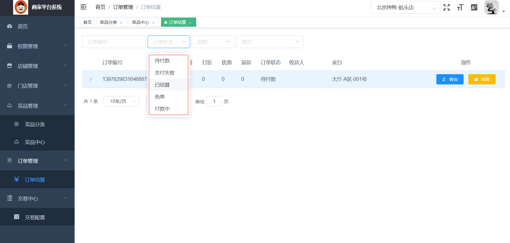

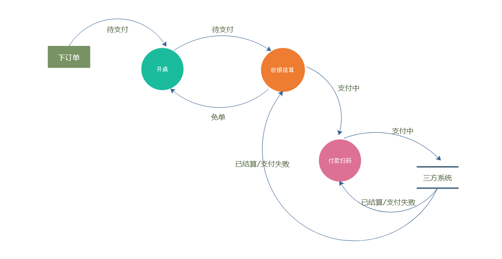

**订单状态：**

订单的状态都被数字字典维护，直接从数字字典中读取

| 状态             | 解释                                                         |
| ---------------- | ------------------------------------------------------------ |
| 待支付           | 用户下单创建订单时                                           |
| 支付中           | 收银员发起结算，生产二维码，用户未扫码或扫码后，三方未给出最终结果钱 |
| 支付失败         | 三方告知当前订单结算失败时                                   |
| 已结算           | 三方告知当前订单结算成功时                                   |
| 免单             | 当前订单无需支付，直接结单                                   |
| 退款【单独字段】 | 已结算后发起的==线下==退款操作                               |


| 名词                 | 解释                                                     |
| -------------------- | -------------------------------------------------------- |
| 优惠                 | 当前结算人员对当前订单进行优惠操作==【与员工权限有关】== |
| 折扣                 | 当前结算人员对当前订单进行折扣操作==【与员工权限有关】== |
| 结算方式【结算渠道】 | 支付宝、现金、免单                                       |

下图为整个订单结算的流程图，我们首先进行下流程分析：


### 1.2、功能开发


- **OrderController**

传入要结算的订单信息发起订单结算：

> 1、获得结算人信息，这里我们可以从UserVoContext中直接获得当前 登录的员工==【统一权限中介绍】==
>
> 2、根据订单生成交易单
>
> 3、调用支付RPC接口，进行支付==【支付系统中介绍】==
>
> 4、结算后桌台状态修改：开桌-->空闲

```java
@PostMapping("handleTrading")
@ApiOperation(value = "订单结算",notes = "订单结算")
@ApiImplicitParam(name = "orderVo",value = "订单信息",dataType = "OrderVo")
@GlobalTransactional
public ResponseWrap<Boolean> handleTrading(@RequestBody OrderVo orderVo){
    //1、获得结算人信息
    String userVoString = UserVoContext.getUserVoString();
    UserVo userVo = JSONObject.parseObject(userVoString, UserVo.class);
    orderVo.setCashierId(userVo.getId());
    orderVo.setCashierName(userVo.getUsername());
    //2、根据订单生成交易单
    TradingVo tradingVo = orderFace.handleTrading(orderVo);
    if (EmptyUtil.isNullOrEmpty(tradingVo)){
        throw new ProjectException(OrderEnum.FAIL);
    }
    //3、调用支付RPC接口，进行支付
    TradingVo tradingVoResult = tradingFace.doPay(tradingVo);
    //4、结算后桌台状态修改：开桌-->空闲
    Boolean flag = true;
    if (EmptyUtil.isNullOrEmpty(tradingVoResult)){
        throw new ProjectException(OrderEnum.FAIL);
    }else {
        TableVo tableVo = TableVo.builder()
            .id(orderVo.getTableId())
            .tableStatus(SuperConstant.FREE).build();
        flag = tableFace.updateTable(tableVo);
        if (!flag){
            throw new ProjectException(OrderEnum.FAIL);
        }
    }
    return ResponseWrapBuild.build(BrandEnum.SUCCEED,flag);
}
```

- **OrderFace**

```java
/***
 * @description 订单交易处理
 * @param orderVo 订单信息
 * @return
 */
TradingVo handleTrading(OrderVo orderVo);
```

- **OrderFaceImpl**

> 1、免单渠道，交易单生成
>
> 2、支付渠道【支付宝、现金】，交易单生成
>
> 3、退款渠道，交易单生成==【下一节实现】==

```java
@Override
@GlobalTransactional
public TradingVo handleTrading(OrderVo orderVo) {
    //免单渠道，交易单生成
    if (orderVo.getTradingChannel().equals(SuperConstant.TRADING_CHANNEL_FREE_CHARGE)){
        return freeChargeTradingVo(orderVo);
    //退款渠道，交易单生成
    }else if (orderVo.getTradingChannel().equals(SuperConstant.TRADING_CHANNEL_REFUND)){
        //TDD
    //支付渠道【现金、支付宝】，交易单生成
    }else {
        return payTradingVo(orderVo);
    }
}
```

**支付渠道，交易单生成**

```java
/***
  * @description 支付渠道，交易单生成
  * @param orderVo
  * @return TradingVo 交易单
  */
private TradingVo payTradingVo(OrderVo orderVo){
    //应付总金额
    BigDecimal payableAmountSum = orderVo.getPayableAmountSum();
    //打折
    BigDecimal discount = orderVo.getDiscount();
    //优惠
    BigDecimal reduce = orderVo.getReduce();
    //计算实付总金额
    BigDecimal realAmountSum = payableAmountSum
        .multiply(discount.divide(new BigDecimal(10))).subtract(reduce);
    //更新订单状态
    Order order = Order.builder().id(orderVo.getId())
        .realAmountSum(realAmountSum)
        .cashierId(orderVo.getCashierId())
        .cashierName(orderVo.getCashierName())
        .orderState(SuperConstant.FKZ)
        .tradingChannel(orderVo.getTradingChannel())
        .isRefund(SuperConstant.NO).build();
    boolean flag = orderService.updateById(order);
    TradingVo tradingVo = null;
    //构建交易单
    if (flag){
        tradingVo = TradingVo.builder()
            .tradingAmount(realAmountSum)
            .tradingChannel(orderVo.getTradingChannel())
            .enterpriseId(orderVo.getEnterpriseId())
            .storeId(orderVo.getTableId())
            .payeeId(orderVo.getCashierId())
            .payeeName(orderVo.getCashierName())
            .productOrderNo(orderVo.getOrderNo())
            .tradingType(SuperConstant.TRADING_TYPE_FK)
            .memo(orderVo.getTableName()+":"+orderVo.getOrderNo())
            .build();
    }
    return tradingVo;
}
```

**免单渠道，交易单生成**

```java
/***
  * @description 免单渠道，交易单生成
  * @param orderVo
  * @return TradingVo 交易单
  */
private TradingVo freeChargeTradingVo(OrderVo orderVo){
    //结算保存订单信息
    Order order = Order.builder().id(orderVo.getId())
        .refund(new BigDecimal(0))
        .discount(new BigDecimal(10))
        .reduce(new BigDecimal(0))
        .tradingChannel(orderVo.getTradingChannel())
        .orderState(SuperConstant.MD)
        .isRefund(SuperConstant.NO)
        .build();
    boolean flag = orderService.updateById(order);
    TradingVo tradingVo = TradingVo.builder()
        .tradingAmount(orderVo.getPayableAmountSum())
        .tradingChannel(orderVo.getTradingChannel())
        .enterpriseId(orderVo.getEnterpriseId())
        .storeId(orderVo.getTableId())
        .payeeId(orderVo.getCashierId())
        .payeeName(orderVo.getCashierName())
        .productOrderNo(orderVo.getOrderNo())
        .tradingType(SuperConstant.TRADING_TYPE_MD)
        .memo(orderVo.getTableName()+":"+orderVo.getOrderNo())
        .build();
    return tradingVo;
}
```


## 2、订单退款

### 2.1、功能区拆解

用户订单支付完成后，发现支付金额不正确，需要收银员进行退款操作，这里不考虑线上退款的情况，退款的前提条件：

> 1、订单处于【已结算】，才可退款
>
> 2、退款金额不能超过实付款
>
> 3、收款人与退款人必须是同一个人，如果不同不可退款

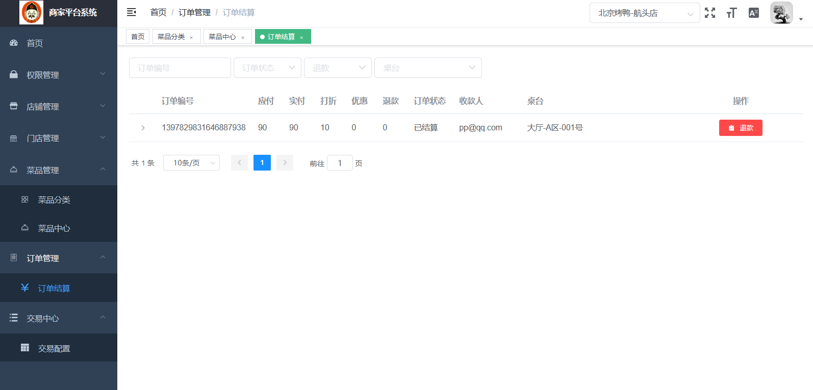

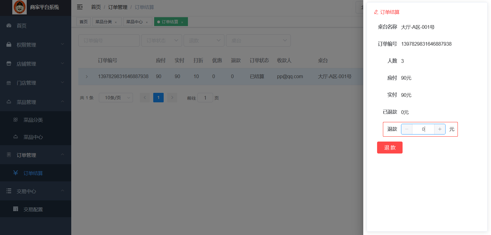

下图为整个订单退款的流程图，我们首先进行下流程分析：

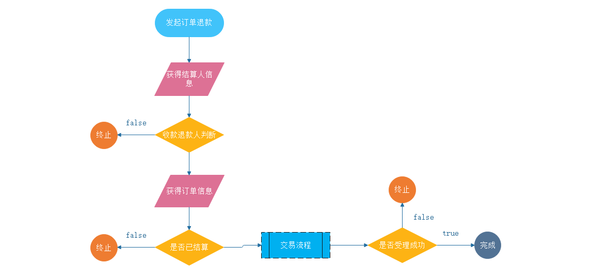

### 2.1、功能开发


- **OrderController**

传入要结算的订单信息发起订单结算：

> 1、获得当前订单结算人信息
>
> 2、退款收款人不为同一人，退款操作拒绝
>
> 3、获取当前交易单信息
>
> 4、当前交易单信息，退款操作拒绝
>
> 5、根据订单生成交易单
>
> 6、执行退款交易

```java
@PostMapping("handle-trading-refund")
@ApiOperation(value = "订单退款",notes = "订单退款")
@ApiImplicitParam(name = "orderVo",value = "订单信息",dataType = "OrderVo")
@GlobalTransactional
public ResponseWrap<Boolean> handleTradingRefund(@RequestBody OrderVo orderVo){
    //1、获得当前订单结算人信息
    String userVoString = UserVoContext.getUserVoString();
    UserVo userVo = JSONObject.parseObject(userVoString, UserVo.class);
    //2、退款收款人不为同一人，退款操作拒绝
    if (orderVo.getTradingChannel().equals(SuperConstant.TRADING_CHANNEL_REFUND)
        &&orderVo.getCashierId().longValue()!=userVo.getId().longValue()){
        throw new ProjectException(OrderEnum.REFUND_FAIL);
    }
    //3、获取当前交易单信息
    OrderVo orderVoBefore = orderFace.findOrderVoPaid(orderVo.getOrderNo());
    //4、当前交易单信息，退款操作拒绝
    if (!SuperConstant.YJS.equals(orderVoBefore.getOrderState())){
        throw new ProjectException(OrderEnum.REFUND_FAIL);
    }
    orderVo.setCashierId(userVo.getId());
    orderVo.setCashierName(userVo.getUsername());
    //5、根据订单生成交易单
    TradingVo tradingVo = orderFace.handleTrading(orderVo);
    if (EmptyUtil.isNullOrEmpty(tradingVo)){
        throw new ProjectException(OrderEnum.FAIL);
    }
    //6、执行退款交易
    TradingVo tradingVoResult = tradingFace.doPay(tradingVo);
    boolean flag = true;
    if (EmptyUtil.isNullOrEmpty(tradingVoResult)){
        throw new ProjectException(OrderEnum.FAIL);
    }
    return ResponseWrapBuild.build(BrandEnum.SUCCEED,flag);
}
```

- **OrderFace**

```java
/***
 * @description 订单交易处理
 * @param orderVo 订单信息
 * @return
 */
TradingVo handleTrading(OrderVo orderVo);
```

- **OrderFaceImpl**

> 1、免单渠道，交易单生成
>
> 2、退款渠道，交易单生成
>
> 3、支付渠道，交易单生成

```java
@Override
@GlobalTransactional
public TradingVo handleTrading(OrderVo orderVo) {
    //免单渠道，交易单生成
    if (orderVo.getTradingChannel().equals(SuperConstant.TRADING_CHANNEL_FREE_CHARGE)){
        return freeChargeTradingVo(orderVo);
    //退款渠道，交易单生成
    }else if (orderVo.getTradingChannel().equals(SuperConstant.TRADING_CHANNEL_REFUND)){
        return refundTradingVo(orderVo);
    //支付渠道，交易单生成
    }else {
        return payTradingVo(orderVo);
    }
}
```

**退款渠道，交易单生成**

```java
/***
  * @description 退款渠道，交易单生成
  * @param orderVo
  * @return TradingVo 交易单
  */
private TradingVo refundTradingVo(OrderVo orderVo){
    Order order = Order.builder().id(orderVo.getId())
        .refund(orderVo.getRefunded().add(orderVo.getOperTionRefund()))
        .isRefund(SuperConstant.YES).build();
    boolean flag = orderService.updateById(order);
    TradingVo tradingVo = TradingVo.builder()
        .tradingAmount(orderVo.getRealAmountSum())
        .tradingChannel(orderVo.getTradingChannel())
        .enterpriseId(orderVo.getEnterpriseId())
        .storeId(orderVo.getTableId())
        .payeeId(orderVo.getCashierId())
        .payeeName(orderVo.getCashierName())
        .productOrderNo(orderVo.getOrderNo())
        .tradingType(SuperConstant.TRADING_TYPE_TK)
        .memo(orderVo.getTableName()+":"+orderVo.getOrderNo())
        .build();
    tradingVo.setProductOrderNo(orderVo.getOrderNo());
    tradingVo.setRefund(orderVo.getRefund());
    tradingVo.setIsRefund(SuperConstant.YES);
    return tradingVo;
}
```
