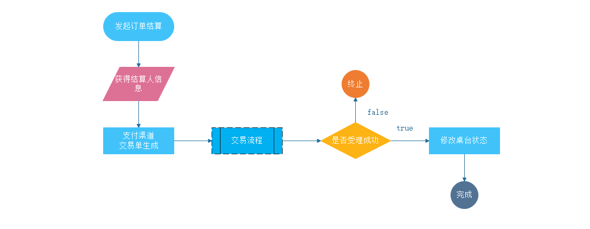
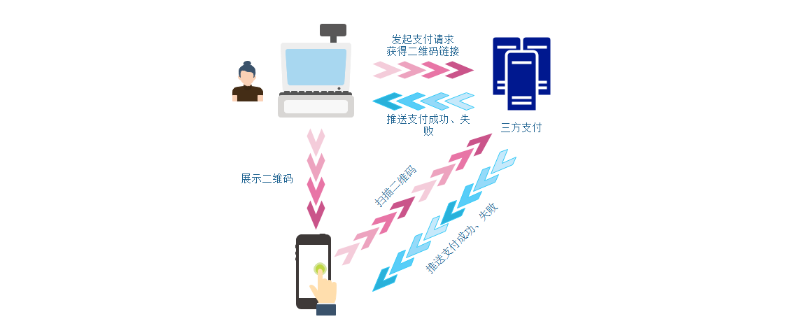
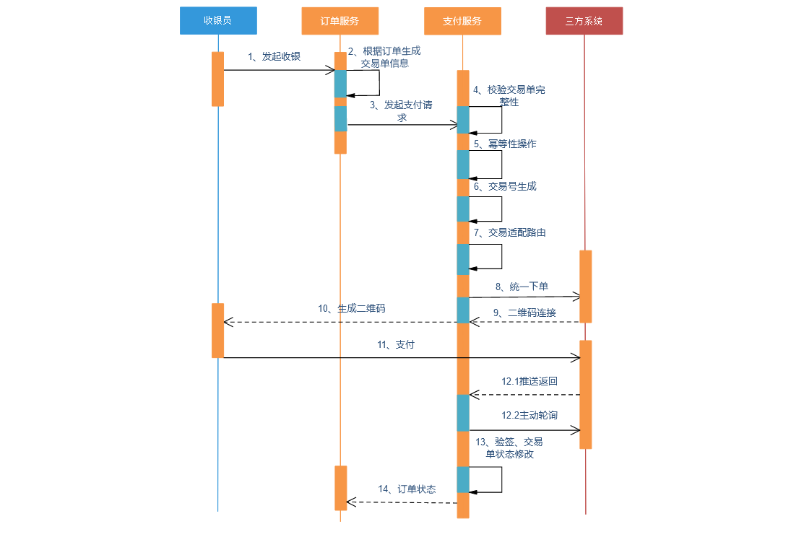
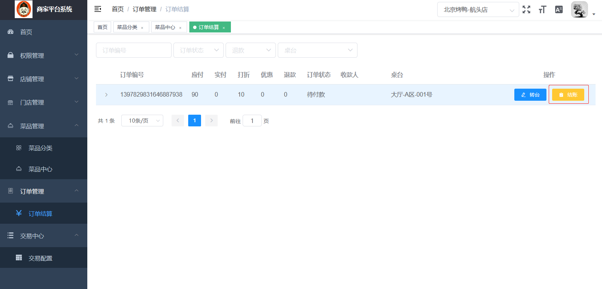
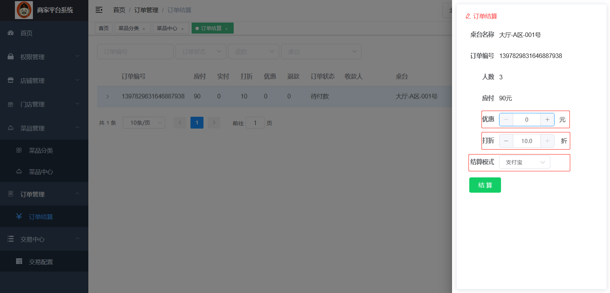
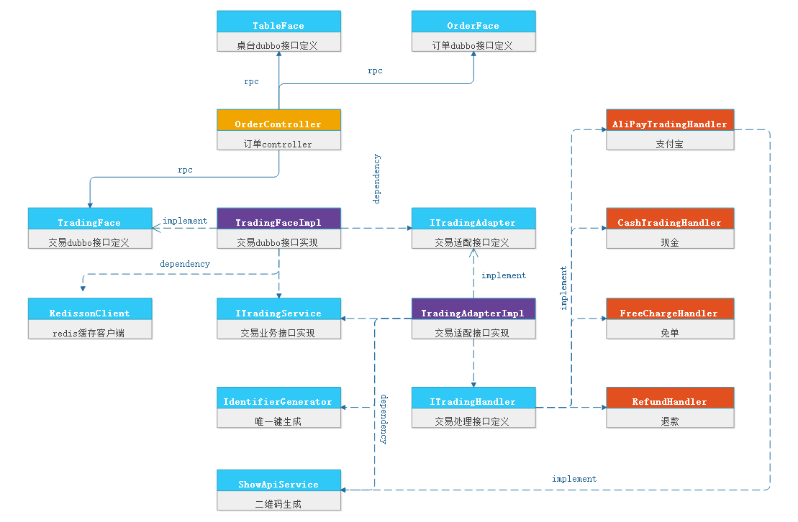
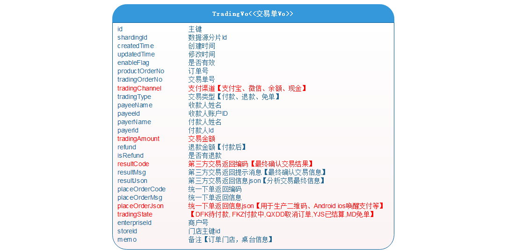
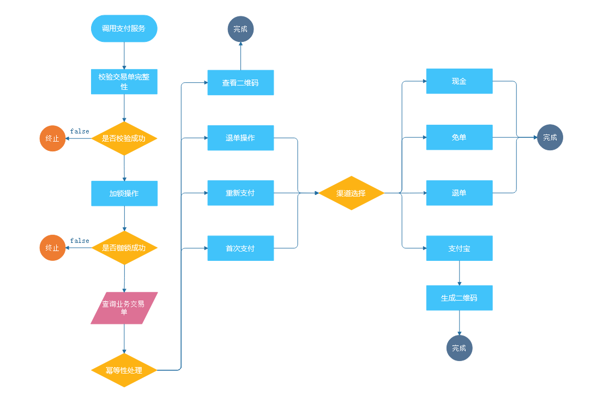
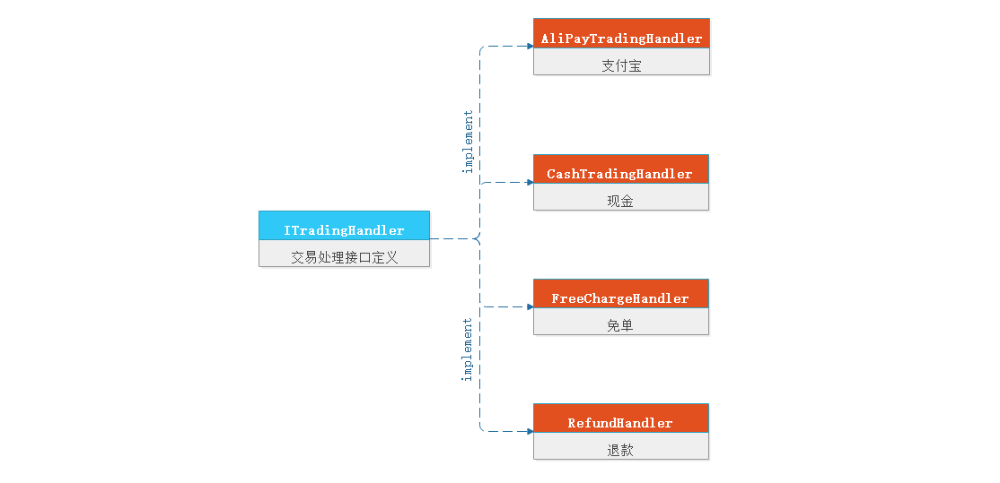

# 学习目标

1、能够描述交易流程

2、能够描述交易时序图中的流程

3、掌握交易统一接口传入参数及返回参数意义

4、掌握交易适配路由的作用【防止并发、幂等性、路由】

5、掌握交易处理接口的作用

# 第一章 交易平台-设计

## 1、交易流程核心

​		下面我们来看下餐掌柜中的交易模块，在昨天的章节中，我们完成了结算这个模块，如图所示，在结算这个模块中我们都会进入到一个子流程：【交易流程】



​		交易的本质是什么？对于交易，大家应该都知道，就是买东西付款，卖东西收款，在任何一个盈利的系统中，都离不开交易模块，下图是一个扫码支付的粗略流程：



> 1、收银人员发起【订单结算】，向三方服务器发起支付请求，获得二维码链接
>
> 2、收银人员展示二维码给客户
>
> 3、客户扫描二维码，向三方支付发起支付
>
> 4、三方支付会为收银系统和用户推送支付状态：成功或失败

==从中我们可以看出所有支付是不是都是类似的，支付系统中关心的几个维度：==

> 1、谁收款？
>
> 2、谁付款？
>
> 3、价格多少？
>
> 4、是否成功

所以到底买的是什么，支付系统是并不关心，那么下面我们看下下交易业务调用时序，图如下所示



## 2、功能区拆解

通过上面的讲解我们了解大体的支付流程，在餐掌柜系统中我们独立出了支付为微服务，让其为整个系统提供支付功能的支持，其项目结构如下：

|——restkeeper-model-trading	交易二级父模块
|
|———— model-trading-interface 	交易接口定义
|
|———— model-trading-job-listen	交易计划任务与监听
|
|———— model-trading-producer	交易平台服务【提供者】
|
|———— model-trading-service	交易平台核心业务实现
|
|———— model-trading-web	交易平台服务web模块【消费者】





| 名词                 | 解释                                                     |
| -------------------- | -------------------------------------------------------- |
| 优惠                 | 当前结算人员对当前订单进行优惠操作==【与员工权限有关】== |
| 折扣                 | 当前结算人员对当前订单进行折扣操作==【与员工权限有关】== |
| 结算方式【结算渠道】 | 支付宝、现金、免单、退款                                 |


上图中的1、2、3步我们都是在==model-shop-web==中完成的，具体内容请查看model-shop-web模块中的OrderController类的handleTrading方法：

```java
@PostMapping("handleTrading")
@ApiOperation(value = "订单结算",notes = "订单结算")
@ApiImplicitParam(name = "orderVo",value = "订单信息",dataType = "OrderVo")
@GlobalTransactional
public ResponseWrap<tradingVoResult> handleTrading(@RequestBody OrderVo orderVo){
    //1、获得结算人信息
    String userVoString = UserVoContext.getUserVoString();
    UserVo userVo = JSONObject.parseObject(userVoString, UserVo.class);
    orderVo.setCashierId(userVo.getId());
    orderVo.setCashierName(userVo.getUsername());
    //2、根据订单生成交易单
    TradingVo tradingVo = orderFace.handleTrading(orderVo);
    if (EmptyUtil.isNullOrEmpty(tradingVo)){
        throw new ProjectException(OrderEnum.FAIL);
    }
    //3、调用支付RPC接口，进行支付
    TradingVo tradingVoResult = tradingFace.doPay(tradingVo);
    //4、结算后桌台状态修改：开桌-->空闲
    Boolean flag = true;
    if (EmptyUtil.isNullOrEmpty(tradingVoResult)){
        throw new ProjectException(OrderEnum.FAIL);
    }else {
        TableVo tableVo = TableVo.builder()
                .id(orderVo.getTableId())
                .tableStatus(SuperConstant.FREE).build();
        flag = tableFace.updateTable(tableVo);
        if (!flag){
            throw new ProjectException(OrderEnum.FAIL);
        }
    }
    return ResponseWrapBuild.build(BrandEnum.SUCCEED,tradingVoResult);
}
```

剩下的操作都是在==model-trading-producer==模块中完成，下面我们来看下整个的UML图，了解支付类之间的调用：



**TradingFace：**交易dubbo接口定义，其中主要负责：发起支付接口、支付状态查询

**TradingFaceImpl：**交易dubbo接口实现

**ITradingAdapter：**交易适配接口，其主要负责：对不同状体及不同渠道的判定适配

**TradingAdapterImpl：**交易适配接口实现

**ShowApiService:** 万维易源智能接口

**ITradingHandler：**交易处理接口，不同渠道支付都需要实现次接口

**AliPayTradingHandlerImpl：**支付宝交易处理接口

**CashTradingHandlerImpl：**现金交易处理接口

**FreeChargeHandlerImpl：**免单交易处理接口

**RefundHandlerImpl：**退款交易处理接口

## 3、功能开发

### 3.1、交易统一接口

**TradingFace：**交易dubbo接口定义，其中主要负责：发起支付接口、支付状态查询,我们看下接口定义：

```java
/***
 * @description 支付业务接口
 * @param tradingVo 交易订单
 * @return: com.itheima.restkeeper.req.TradingVo
 */
TradingVo doPay(TradingVo tradingVo) throws ProjectException;
```



**TradingFaceImpl：**交易dubbo接口实现



> 1、校验交易单完整性：订单为空，订单号为空，企业号为空，交易金额为空，支付渠道为空
>
> 2、加锁操作
>
> 3、交易适配路由
>
> ​	3.1、幂等性处理
>
> ​	3.2、渠道的路由

```java
@Override
@GlobalTransactional
public TradingVo doPay(TradingVo tradingVo) throws ProjectException {
    //1、校验交易单完整性
    Boolean flag = this.doPayCheckTradingVo(tradingVo);
    if (!flag){
        throw  new ProjectException(TradingEnum.CHECK_TRADING_FAIL);
    }
    //2、加锁操作
    String key = TradingCacheConstant.DO_PAY+tradingVo.getProductOrderNo();
    RLock lock = redissonClient.getLock(key);
    try {
        if (lock.tryLock(
            TradingCacheConstant.REDIS_WAIT_TIME,
            TradingCacheConstant.REDIS_LEASETIME,
            TimeUnit.SECONDS)){
            log.info("======>开始创建支付订单tradingVo：{}",tradingVo.toString());
            //3、支付路由适配
            TradingVo tradingVoResult = tradingAdapter.doPay(tradingVo);
            log.info("======>返回创建支付订单tradingVo：{}",tradingVo.toString());
            return tradingVoResult;
        }
    } catch (InterruptedException e) {
        log.warn("支付订单加锁失败tradingVo：{}",tradingVo.toString());
        throw new ProjectException(TradingEnum.TRYLOCK_TRADING_FAIL);
    }finally {
        lock.unlock();
    }
    log.error("支付订单失败tradingVo：{}",tradingVo.toString());
    throw new ProjectException(TradingEnum.PAYING_TRADING_FAIL);
}
```

### 3.2、交易适配路由

**ITradingAdapter：**交易适配接口

```java
/***
 * @description 支付业务接口
 * @param tradingVo
 * @return: com.itheima.springcloud.req.TradingVo
 */
TradingVo doPay(TradingVo tradingVo) throws ProjectException;
```

**TradingAdapterImpl：**

> 1、幂等性判断
>
> ​		1.1、查看二维码：交易单不为空，且交易状态为待支付
>
> ​		1.2、退单操作：交易单不为空，交易状态为成功，渠道为退款操作
>
> ​		1.3、重新支付：交易单不为空，且交易状态为关闭【取消支付、支付失败】，说明交易超时，废弃当前的交易号
>
> ​		1.4、重复支付：交易单不为空，且交易状态为成功，则直接抛出异常，告知交易单已完成
>
> ​		1.5、首次支付
>
> 2、渠道判定：
>
> ​		2.1、支付宝
>
> ​		2.2、现金
>
> ​		2.3、免单
>
> ​		2.4、退款

```java
@Autowired
ITradingHandler aliPayTradingHandler;

@Autowired
ITradingHandler cashTradingHandler;

@Autowired
ITradingHandler freeChargeHandler;

@Autowired
ITradingHandler refundHandler;

@Autowired
ShowApiService showApiService;

@Autowired
ITradingService tradingService;

@Autowired
IdentifierGenerator identifierGenerator;

/***
     * @description 幂等性处理
     *
     * @param tradingVo
     * @return
     */
private TradingVo idempotenceTradingVo(TradingVo tradingVo){
    //1、查询业务交易单
    Trading trading = tradingService.findTradingByProductOrderNo(tradingVo.getProductOrderNo());
    //2.1、查看二维码：交易单不为空，且交易状态为待支付,且是线上支付
    if (!EmptyUtil.isNullOrEmpty(trading)
        &&trading.getTradingState().equals(SuperConstant.FKZ)
        &&trading.getTradingChannel().equals(SuperConstant.TRADING_CHANNEL_ALIPAY)){
        TradingVo tradingVoResult = BeanConv.toBean(trading,TradingVo.class);
        String imgUrl = showApiService.handlerQRcode(tradingVoResult.getPlaceOrderMsg());
        tradingVoResult.setImgUrl(imgUrl);
        return tradingVoResult;
        //2.2、退单操作：交易单不为空，交易状态为成功，渠道为退款操作
    }else if (!EmptyUtil.isNullOrEmpty(trading)
              &&trading.getTradingState().equals(SuperConstant.YJS)
              &&SuperConstant.TRADING_CHANNEL_REFUND.equals(tradingVo.getTradingChannel())){
        tradingVo.setId(trading.getId());
        log.info("退款支付：{}",tradingVo.toString());
        //2.3、重新支付：交易单不为空，且交易状态为关闭，说明交易超时，废弃当前的交易号
    }else if (!EmptyUtil.isNullOrEmpty(trading)
              &&trading.getTradingState().equals(SuperConstant.QXDD)){
        tradingVo.setId(trading.getId());
        tradingVo.setTradingOrderNo((Long) identifierGenerator.nextId(tradingVo));
        //2.4、重复支付:如果交易单不为空，且交易状态为成功，则直接抛出异常，告知交易单已完成
    }else if (!EmptyUtil.isNullOrEmpty(trading)
              &&trading.getTradingState().equals(SuperConstant.YJS)){
        throw  new ProjectException(TradingEnum.TRADING_STATE_SUCCEED);
        //2.5、首次支付
    }else {
        tradingVo.setTradingOrderNo((Long) identifierGenerator.nextId(tradingVo));
        log.info("首次支付：{}",tradingVo.toString());
    }
    return tradingVo;
}

/***
  * @description 交易路由选择
  *
  * @param tradingVo
  * @return
  */
private TradingVo routeTrading(TradingVo tradingVo){
    //4.1、支付宝
    if (SuperConstant.TRADING_CHANNEL_ALIPAY.equals(tradingVo.getTradingChannel())){
        return aliPayTradingHandler.doPay(tradingVo);
     //4.2、现金
    }else if(SuperConstant.TRADING_CHANNEL_CASHPAY.equals(tradingVo.getTradingChannel())){
        return cashTradingHandler.doPay(tradingVo);
    //4.3、免单
    }else if(SuperConstant.TRADING_CHANNEL_FREE_CHARGE.equals(tradingVo.getTradingChannel())){
        return freeChargeHandler.doPay(tradingVo);
    //4.4、退款
    }else if(SuperConstant.TRADING_CHANNEL_REFUND.equals(tradingVo.getTradingChannel())){
        return refundHandler.doPay(tradingVo);
    }else {
        return null;
    }
}

@Override
public TradingVo doPay(TradingVo tradingVo) throws ProjectException {
    //1、查询业务交易单
    Trading trading = tradingService.findTradingByProductOrderNo(tradingVo.getProductOrderNo());
    //2、查看二维码：交易单不为空，且交易状态为待支付,且是线上支付
    if (!EmptyUtil.isNullOrEmpty(trading)
        &&trading.getTradingState().equals(SuperConstant.FKZ)
        &&trading.getTradingChannel().equals(SuperConstant.TRADING_CHANNEL_ALIPAY)){
        TradingVo tradingVoResult = BeanConv.toBean(trading,TradingVo.class);
        String imgUrl = showApiService.handlerQRcode(tradingVoResult.getPlaceOrderMsg());
        tradingVoResult.setImgUrl(imgUrl);
        return tradingVoResult;
    }
    //3、幂等性处理
    tradingVo = this.idempotenceTradingVo(trading,tradingVo);
    //4、交易路由选择
    return this.routeTrading(tradingVo);
}
```

### 3.3、交易处理接口

**ITradingHandler：**交易处理接口，不同渠道支付都需要实现次接口

```java
/***
 * @description 交易处理接口
 * @param tradingVo
 * @return: com.itheima.springcloud.req.TradingVo
 */
TradingVo doPay(TradingVo tradingVo) throws ProjectException;
```



==具体每个渠道的实现的，我们再明天节进行讲解==

